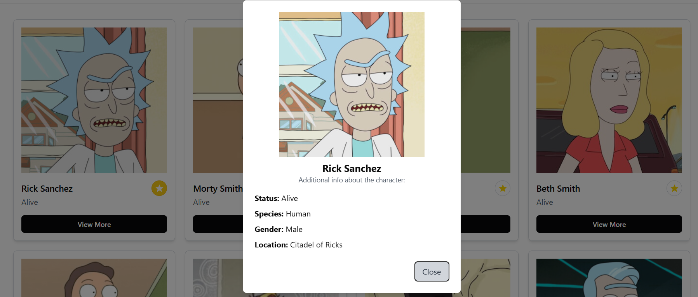

# Rick_n_Morty_APP

I'm happy to show you my project where I play mostly with frontend technologies and a bit of backend using [Rick & Morty API](https://rickandmortyapi.com/documentation/) 

## Goals:
- [x] Render Rick & Morty API
- [x] Create Github actions workflow with few tests
- [x] Use Tanstack query
- [x] Create JSON server
- [x] Use Tanstack router
- [x] Implement good Searchbar with filtration
- [x] Implement Navigation, Pagination 
- [x] Create page with "favorites" where user could save all his favorite characters
